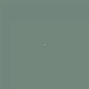

## Distilling Dynamics from Pretrained Models
  
Peter Whidden, compute(r)ender

--- 

Models trained on large datasets often capture information which can be applied beyond their originally intended tasks and domains. [Dream Fields](https://arxiv.org/abs/2112.01455) showed that 3D structure can be extracted from a CLIP model trained on only 2D images by distilling it into a NeRF model that enforces consistency in 3D space. [DreamFusion](https://arxiv.org/abs/2209.14988) improved upon these results by leveraging a generative diffusion model. This approach is intuitive, given that these models are capable of representing a particular subject from multiple perspectives. Additionally, however, these models may also be able to represent a subject at multiple points in time. Given this, perhaps it is possible that dynamics could be distilled into a model that enforces a consistent structure over time and space. It would be incredibly useful to optimize an arbitrary system by simply requiring that it must "look right". This code explores some simple ways this might be realized.

For example, here is Stable Diffusion conditioned on the prompt "raindrops on glass" distilled into a [Neural Cellular Automata](https://distill.pub/selforg/2021/textures/) model:  

    

And another iteration:

The motion seen in this experiment likely owes more to the strong inductive bias of NCA than to dynamics in the diffusion model. Currently, this method is primarily aspirational.

